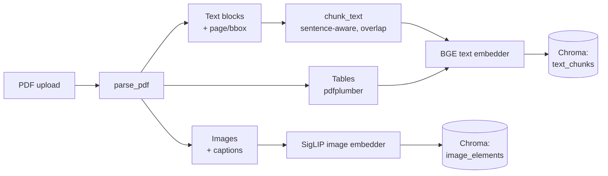
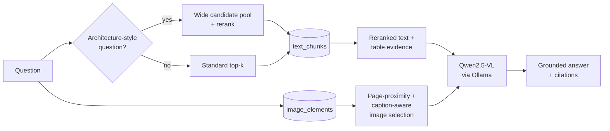

# MultiRAG — Multimodal Document Intelligence

A Retrieval-Augmented Generation system that reads PDFs the way a person does: as text, tables,
and diagrams together, not just a wall of extracted text. Upload a PDF, ask a question, and get
an answer grounded in whichever mix of text, tables, and images actually contains the evidence —
with page-level citations, not just a source name.

Built as a portfolio project to go beyond the typical "chunk-and-embed-text" RAG tutorial: separate
extraction and embedding pipelines for text, tables, and images, a local vision-language model for
generation, and a Streamlit UI that treats retrieval controls as real settings rather than decoration.

<!-- Add screenshots after you run it locally, e.g.: -->
<!--  -->
<!--  -->

## Table of contents

- [Features](#features)
- [Architecture](#architecture)
- [Tech stack](#tech-stack)
- [Project structure](#project-structure)
- [Setup](#setup)
- [Usage](#usage)
- [API reference](#api-reference)
- [Configuration](#configuration)
- [Design decisions](#design-decisions)
- [Known limitations](#known-limitations)
- [Roadmap](#roadmap)

## Features

- **Multimodal ingestion** — PyMuPDF extracts text blocks and embedded images with page + bounding-box
  metadata; pdfplumber extracts table structure separately, since PyMuPDF's own table detection is
  weaker. A de-duplication pass drops text blocks that overlap a detected table so content isn't
  indexed twice.
- **Two embedding spaces, not one** — text/table chunks are embedded with `bge-small-en-v1.5`;
  images are embedded with `SigLIP`. Rather than forcing both into one shared space via a fusion
  model, each modality gets its own ChromaDB collection, queried separately and combined at the
  retrieval layer.
- **Question-aware retrieval** — architecture/diagram-style questions ("explain the model",
  "how does the encoder work") get a wider candidate pool and a rerank pass that filters out
  navigation/reference content, favors technical-vocabulary-dense chunks, and boosts whatever
  named terms (model names, acronyms) the question itself mentions — so it generalizes across
  documents instead of being tuned to one paper.
- **Real grounding signal** — the API reports whether it actually found relevant evidence, and the
  UI surfaces a warning when it didn't, instead of only trusting the LLM to hedge appropriately.
- **A UI where every control does something** — text/image/table retrieval toggles, Top-K,
  temperature, and "show evidence" are all wired into the actual `/ask` request; none are decorative.
- **Local-only inference** — Qwen2.5-VL 3B via Ollama, so there's no per-query API cost while
  building and iterating.

## Architecture

### Ingestion (`POST /ingest`)



### Query (`POST /ask`)



Text and image retrieval are independent queries against two separate Chroma collections — there's
no single fused embedding space. The rerank and image-selection steps exist because semantic
similarity alone tends to under-rank the one or two chunks/diagrams that actually describe a given
document's model, especially on architecture-style questions.

## Tech stack

| Layer | Choice | Why |
|---|---|---|
| PDF parsing | PyMuPDF + pdfplumber | PyMuPDF for fast text/image/bbox extraction; pdfplumber specifically for table structure, which PyMuPDF handles poorly |
| Text embeddings | `BAAI/bge-small-en-v1.5` | Small, fast, strong MTEB retrieval score, runs fine on CPU/MPS |
| Image embeddings | `google/siglip-base-patch16-224` | Outperforms CLIP at comparable compute; solid MPS support on Apple Silicon |
| Vector store | ChromaDB (persistent, two collections) | Simple, local, no external service to run |
| LLM | Qwen2.5-VL 3B via Ollama | Local, vision-capable, no per-query API cost |
| Backend | FastAPI | Thin HTTP layer over `app/services/*` |
| Frontend | Streamlit | Fast to iterate; native chat/status/dataframe widgets fit this use case well |

## Project structure

```
multimodal-rag-project/
├── backend/
│   ├── app/
│   │   ├── main.py                 # FastAPI app
│   │   ├── api/routes.py           # /health, /ingest, /ask
│   │   ├── core/config.py          # centralized, env-overridable settings
│   │   ├── models/schemas.py       # pydantic request/response/element models
│   │   └── services/
│   │       ├── pdf_parser.py       # text/table/image extraction
│   │       ├── chunking.py         # sentence-aware sliding window
│   │       ├── embeddings.py       # BGE + SigLIP wrappers
│   │       ├── vectorstore.py      # Chroma indexing + querying
│   │       ├── rag.py              # retrieval, reranking, orchestration
│   │       └── generation.py       # Ollama + Qwen2.5-VL prompting
│   └── data/                       # raw_pdfs/, processed/, chroma/ (gitignored)
├── frontend/
│   └── app.py                      # Streamlit UI
├── tests/                          # (planned)
├── notebooks/                      # (planned — retrieval/answer eval)
├── docs/                           # screenshots, write-ups
├── requirements.txt
└── .env.example
```

## Setup

Requires Python 3.10+, and [Ollama](https://ollama.com) installed locally.

```bash
# 1. Clone and enter the project
git clone <your-repo-url>
cd multimodal-rag-project

# 2. Create a virtual environment
python3 -m venv venv
source venv/bin/activate

# 3. Install dependencies
pip install -r requirements.txt

# 4. Pull the vision-language model
ollama pull qwen2.5vl:3b

# 5. (Optional) copy env config
cp .env.example .env   # see Configuration below
```

## Usage

```bash
# Terminal 1 — backend
cd backend
uvicorn app.main:app --reload

# Terminal 2 — model server (if not already running)
ollama serve

# Terminal 3 — frontend
cd frontend
streamlit run app.py
```

Open the Streamlit URL it prints (usually `http://localhost:8501`), upload a PDF, wait for
"Document indexed," and start asking questions. Try one of the example prompts on the welcome
screen, or ask something specific like *"What does Table 3 show?"* or *"Explain the architecture
shown in the document."*

## API reference

### `GET /health`
Liveness check.
```json
{ "status": "ok", "service": "multimodal-rag-api" }
```

### `POST /ingest`
Multipart form upload, field name `file` (PDF only).

**Response**
```json
{
  "message": "PDF ingested successfully.",
  "doc_id": "paper_a1b2c3d4",
  "source_filename": "paper.pdf",
  "num_pages": 42,
  "text_chunks": 210,
  "tables": 14,
  "images": 23
}
```

### `POST /ask`
```json
{
  "doc_id": "paper_a1b2c3d4",
  "question": "Explain the architecture shown in the document.",
  "top_k_text": 5,
  "top_k_images": 3,
  "include_text": true,
  "include_images": true,
  "include_tables": true,
  "temperature": 0.15
}
```
Only `doc_id` and `question` are required — every other field defaults to the values shown above.

**Response**
```json
{
  "answer": "...",
  "grounded": true,
  "citations": [
    { "source_id": "S1", "page": 25, "type": "text", "label": "Text source" },
    { "source_id": "I1", "page": 25, "type": "image", "label": "Image source" }
  ],
  "retrieved_text": [ { "source_id": "S1", "page": 25, "type": "text", "distance": 0.18, "content": "..." } ],
  "retrieved_images": [ { "source_id": "I1", "page": 25, "type": "image", "distance": 0.22, "file_path": "...", "caption": "..." } ]
}
```
`grounded` is `false` only when retrieval returned no text or image evidence at all — a signal the
UI surfaces as a warning rather than letting the model quietly answer from general knowledge.

## Configuration

Everything in `backend/app/core/config.py` is overridable via a `.env` file at the project root:

| Setting | Default | Notes |
|---|---|---|
| `chunk_size_chars` / `chunk_overlap_chars` | `1000` / `150` | Text chunking window |
| `text_embedding_model` | `BAAI/bge-small-en-v1.5` | |
| `image_embedding_model` | `google/siglip-base-patch16-224` | |
| `embedding_device` | `mps` | Falls back to CPU automatically if MPS is unavailable |
| `top_k_text` / `top_k_images` | `4` / `2` | Server-side defaults; overridable per-request via `/ask` |
| `llm_provider` | `ollama` | `ollama \| anthropic \| openai` — swappable, only `ollama` is wired up today |
| `ollama_host` | `http://localhost:11434` | |

> **Note:** `ollama_model` in `config.py` is currently unused — `generation.py` hardcodes
> `qwen2.5vl:3b` directly. See [Known limitations](#known-limitations).

## Design decisions

A few choices worth being able to talk through:

- **Two Chroma collections instead of one fused space.** Forcing text and image embeddings into a
  shared space usually means training or fine-tuning a joint encoder. Keeping them separate and
  combining results at the retrieval layer is simpler, lets each modality use the embedding model
  best suited to it, and is easy to reason about when debugging a bad retrieval.
- **Reranking is question-driven, not document-specific.** Early versions of the reranker
  hardcoded boosts for specific model names encountered while testing against one PDF — a classic
  overfitting trap. The current version extracts candidate named terms (acronyms, hyphenated
  names, anything with digits) straight from the *question*, so it generalizes to whatever document
  or model the user actually asks about.
- **The vision model, not retrieved text, is the primary source for architecture questions.** The
  system prompt (see `generation.py`) explicitly tells the model to treat the architecture diagram
  as ground truth and not blend in details from unrelated architectures the retrieved text might
  mention — a real failure mode when a paper compares its method against several baselines.
- **`grounded` is computed, not asserted.** Rather than asking the LLM to self-report whether it
  had enough evidence (which models are unreliable at), the flag is a simple, auditable check: did
  retrieval return anything at all.

## Known limitations

- `config.py`'s `ollama_model` setting isn't actually wired up; the model name is hardcoded in
  `generation.py`.
- "Remove document" clears frontend state only — there's no backend endpoint to delete an indexed
  document's data from disk or from Chroma.
- Not containerized. Ollama in particular is awkward to containerize cleanly for local development,
  so Docker support would likely cover backend + frontend + Chroma only, with Ollama run on the host.

## Roadmap

- [x] Generalize `generation.py`'s exclusion rule the same way `rag.py`'s reranker was generalized
- [x] Unit tests for the pure functions (`chunk_text`, the reranker, markdown-table parsing)
- [x] A small eval set measuring retrieval relevance and answer faithfulness
- [ ] `docker-compose.yml` for backend + frontend + Chroma volume
- [ ] `.env.example` documenting every overridable setting